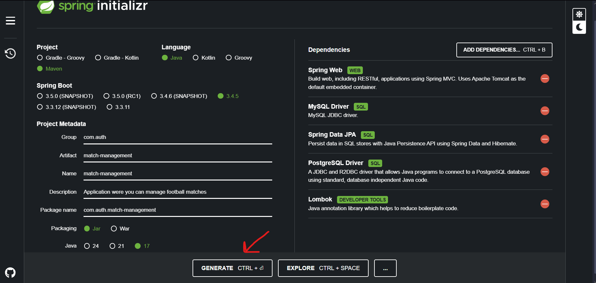
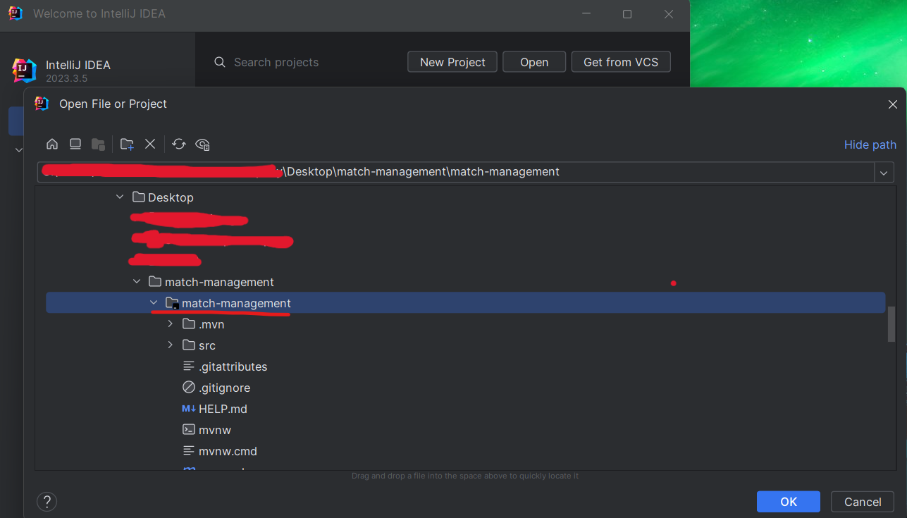
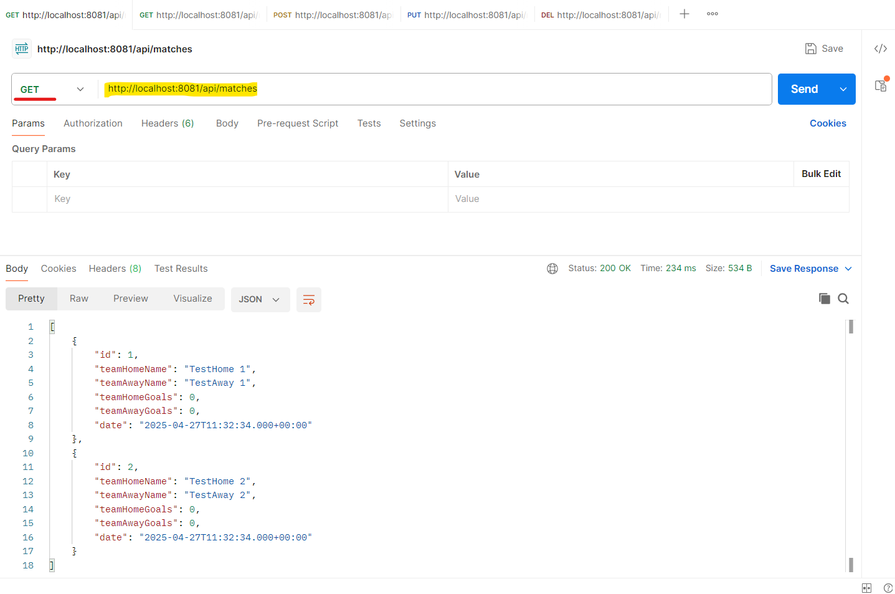

# SFHMMY Java Spring Boot workshop
<h4> A simple REST API with Java Spring Boot</h4>

<h4>What will you need?</h4>
<ul>
  <li>Java JDK</li>
  <li>Maven</li>
  <li>An IDE for example IntelliJ IDEA</li>
  <li>XAMPP</li>
  <li>Postman</li>
</ul>

<h3>How to initiate your project?</h3>

Go to https://start.spring.io, fill the fields, select your dependencies and then click on "Generate". After that a .zip file with start to downloading with your whole project initial setup.

<h3>Open your project on your IDE</h3>

Extract the .zip file and the open your project on the IDE that you are using.

<h3>Setup yout DB server</h3>

Open XAMPP and start Apache and MySQL servers. Keep in mind that your MySQL server may run on a different port than mine on the screenshot below. 

<h3>Create your database</h3>

After Apache and MySQL servers were running with success, open a browser and type "http://localhost" and on the top navigation menu select the option "phpMyAdmin". You will be navigated on the DB
administration page so you have to create your database by clicking "New" on the left, type the name of the db (matches_db) and then click on "create" button. Now you have an empty db for our application.

<h3>Test your REST API</h3>

After you completed the previous steps and your code is implemented, start you application with the green play button on the top (for IntelliJ) and open Postman tool so to test our endpoints.

<h4>GET method (to retrieve all saved matches)</h4>

<h4>GET method (to retrieve a signle match by its Id)</h4>

<h4>POST method (to create a single match)</h4>

<h4>PUT method (to update a match)</h4>

<h4>DELETE method (to delete a match from our database)</h4>

<h3>How our database will look like?</h3>

If you follow step by step the previous requests, your database will end up like this:

